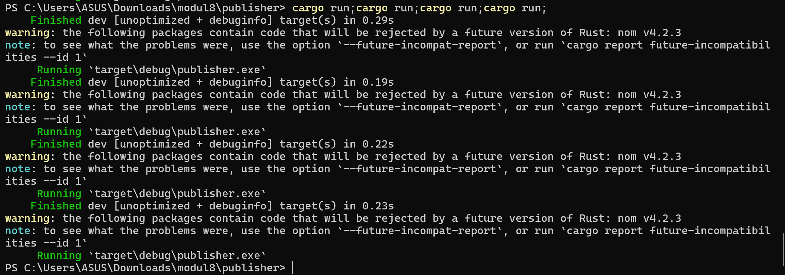
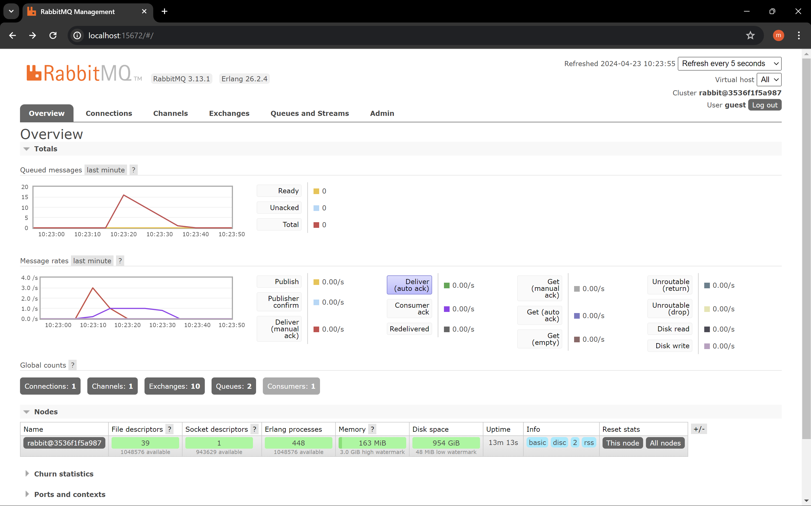

1. What is amqp? Kepanjangan AMQP adalah Advanced Message Queueing Protocol. AMQP adalah standard design untuk messaging yang dirancang untuk bekerja pada lingkungan middleware. Sesuai namanya "standard design", maka harapannya dengan AMQP dapat membangun konsistensi pada komunikasi antar sistem yang beragam. AMQP memungkinkan aplikasi untuk mengirimkan pesan ke queue. Selain itu, AMQP juga memungkinkan aplikasi untuk menerima pesan dari queue. Dengan demikian, apliaksi dapat bertukar pesan (messaiging) dengan sistem lain. 

2. What it means? guest:guest@localhost:5672, what is the first quest, and what is the second guest, and what is localhost:5672 is for?
Jelas bahwa guest:guest adalah format username:password. Dengan demikian, first guest adalah username. Di sisi lain, second guest adalah password. Kemudian, @localhost:5672 adalah format @hostname:port_number dari broker AMQP. Dengan demikian,  localhost adalah hostname dari mesin tempat broker berjalan. Sedangkan 5672 adalah port number (pada AMQP, default portnya adalah 5672) di mana broker AMQP akan keep track connecetions. Maka dari itu, guest:guest@localhost:5672 berarti connections akan berjalan di localhost pada port number 5672 dengan username "guest" dan password "guest".

Simulation slow subscriber screenshot:

Simulasi slow subscriber dapat dilihat pada gambar di atas. Jika dilihat, terdapat 15 queued messages. Hal ini terjadi karena saya mengirimkan "cargo run" sebanyak 4 kali. Dengan kata lain, program publisher saya jalankan sebanyak 4 kali. Sebagaimana telah dijelaskan sebelumnya, program publisher in one run akan mengirimkan 5 data ke message broker. Kemudian, karena yang queued ada 3 program publisher, sehingga queued messagesnya menjadi 3 * 5 = 15.

Hal yang dapat diimprove dari program subscriber:
- Kurangi penggunaan method unwrap karena dapat menyebabkan panic
- Mengimplementasikan method get_handler_action untuk menghindari panic